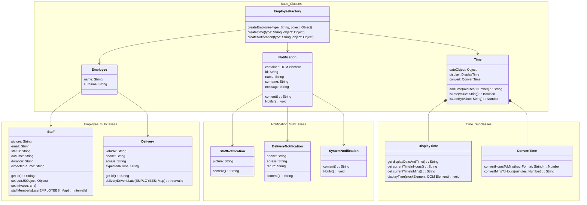

```mermaid
classDiagram

%% Relationships %%
EmployeeFactory --> Employee
EmployeeFactory --> Time
EmployeeFactory --> Notification

Employee --> Staff
Employee --> Delivery

Time *-- DisplayTime
Time *-- ConvertTime

Notification --> StaffNotification
Notification --> DeliveryNotification
Notification --> SystemNotification

namespace Base_Classes {

    class EmployeeFactory {
        createEmployee(type: String, object: Object)
        createTime(type: String, object: Object)
        createNotification(type: String, object: Object)
    }

        class Employee {
        name: String
        surname: String
    }

        class Notification {
            container: DOM element
            id: String
            name: String
            surname: String
            message: String

            content(): String           
            Notify(): void
    }

        class Time {
        dateObject: Object
        display: DisplayTime
        convert: ConvertTime

        addTime(minutes: Number): String
        isLate(value: String): Boolean
        isLateBy(value: String): Number
    }
}

namespace Employee_Subclasses {

    class Staff {
        picture: String
        email: String
        status: String
        outTime: String
        duration: String
        expectedRTime: String
        
        get id(): String

        set out(JSObject: Object)
        set in(value: any)
        staffMemberIsLate(EMPLOYEES: Map): IntervalId
    }

    class Delivery {
        vehicle: String
        phone: String
        adress: String
        expectedRTime: String

        get id(): String

        deliveryDriverIsLate(EMPLOYEES: Map): IntervalId
    }
}

namespace Notification_Subclasses {
    class StaffNotification {
        picture: String
        content(): String
    }

    class DeliveryNotification {
        phone: String
        adress: String
        return: String
        content(): String
    }

    class SystemNotification {
        content(): String
        Notify(): void
    }
}


namespace Time_Subclasses {
    
    class DisplayTime {
        get displayDateAndTime(): String
        get currentTimeInHours(): String
        get currentTimeInMins(): String
        
        displayTime(clockElement: DOM Element): void
    }

    class ConvertTime {
        convertHoursToMins(hourFormat: String): Number
        convertMinsToHours(minutes: Number): String
    }
}

```