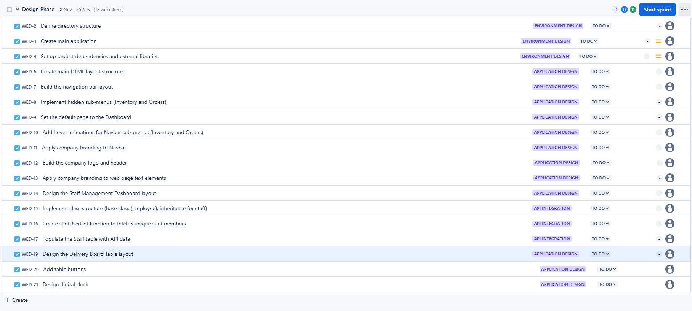
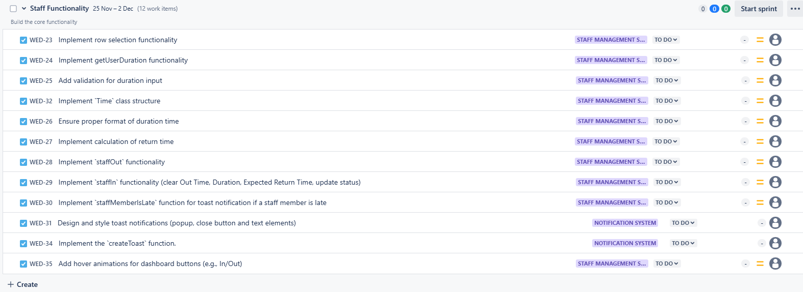
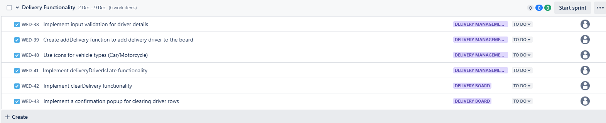
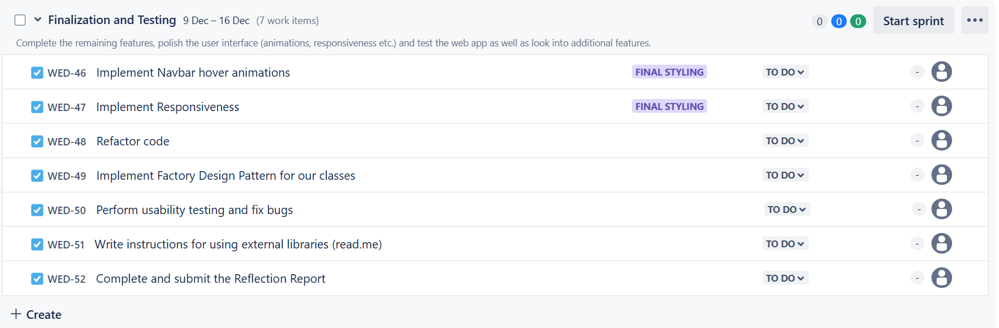

# Jira Project

# Table of Contents

1. [Jira Project](#jira-project)
2. [Sprint Plan (4 weeks)](#sprint-plan-4-weeks)
   - [Sprint 1: Design Phase (18 Nov - 24 Nov)](#sprint-1-18-nov---24-nov---design-phase-1-week)
     - [Goal](#goal)
     - [Overview](#overview)
     - [Epics](#epics)
     - [Screenshots and explanation](#screenshots-and-explanation)
   - [Sprint 2: Staff Functionality (25 Nov - 2 Dec)](#sprint-2-25-nov---2-dec---staff-functionality-1-week)
     - [Goal](#goal-1)
     - [Overview](#overview-1)
     - [Epics](#epics-1)
     - [Screenshots and explanation](#screenshots-and-explanation-1)
   - [Sprint 3: Delivery Functionality (2 Dec - 8 Dec)](#sprint-3-2-dec---8-dec---delivery-functionality-1-week)
     - [Goal](#goal-2)
     - [Overview](#overview-2)
     - [Epics](#epics-2)
     - [Screenshots and explanation](#screenshots-and-explanation-2)
   - [Sprint 4: Finalization and Testing (9 Dec - 15 Dec)](#sprint-4-9-dec---15-dec---finalization-and-testing-1-week)
     - [Goal](#goal-3)
     - [Overview](#overview-3)
     - [Epics](#epics-3)
     - [Screenshots and explanation](#screenshots-and-explanation-3)
3. [Reflection Report](#reflection-report)

# Sprint Plan (4 weeks)

In this project, we are going to use 4 weeks to develop our application for the We Deliver Tech application, each focusing on a set of epics, issues and tasks.

## Sprint 1 (18 Nov - 24 Nov) - Design Phase (1 week)

### Goal

Set up the development environment, structure the project and implement core features.

### Overview:

We want to establish the foundational components for the project, focusing on dependencies, layout, navigation and creating core tables with styling. This sprint is aimed to complete all the essential groundwork.

This sprint is categorized in the following main focus areas:

-  Environment Design covers application structure, dependencies as well as internal and external libraries.
-  Application Design covers the design of the application itself, main componenets and elements required for our application to function without any specific functionality added.
-  API Integration covers the API call functionality needed for our Staff users to be created and populated into our Staff Management application.

### Epics

-  Environment Design

  - Issues

  1.  Define application structure
     - The directory structure for this project will be based on a logical and modular structure. We want want to have the main application easily accessible for our client while dependencies are placed inside our `src` folder, their in their own folder:
     - `/api`: API-related scripts.
     - `/classes`: Reusable class definitions and functions.
     - `/components`: User Interface elements, such as toasts or additional features.
     - `/events`: Event management, such as row selection.
     - `/styles`: Stylesheets.
     - `/utilities`: Utility functions and shared resources.
  2.  Create main application

     - The main application will consist of a HTML file that is going to be used to structure the content of the webpage. This page will mostly consist of text, images, tables and images.
     - The path to the main application is: `/Web Application/index.html`

  3.  Set up project core dependencies and external libraries.
     - We are going to use CSS stylesheets for the styling and positioning of our web elements. We are also going to rely on JavaScript for the manipulation of web elements, for example populating the tables, selecting rows and also time and date conversion as well as conditional logic for the notification to show up on the screen when staffs or deliveries are late. Finally we are going to use Bootstrap for our toast notification, but also some additional styling and use of Icons. While Bootstrap provides us with a wide variaty of icons, we are also going to use Font Awesome for more icon options.
       - Overview of Core Dependencies
         - CSS: Stylesheet: `/Web Application/src/styles/wdt_style.css`
         - JS: Main script: `/Web Application/src/wdt_app.js`
         - Frameworks (these are all linked through CDN in the HEAD of our `index.html` application.):
           - Bootstrap (CSS, JS and Icons CDN)
           - Font Awesome (Icons)

-  Application Design

  - Issues

  1.  Create main HTML layout structure
     - Our main goal for the application layout is to have a main container with divs in it, this way we can position and have a consistent structure over the individual divs inside the container.
     - HTML HEAD: device viewport support and core dependencies.
     - HTML BODY:
       - Main div container
         - Navbar
         - Logo and header
         - Staff
         - Schedule
         - Delivery
         - Footer (digital clock)
  2.  Build the navigation bar layout
     - Our nav will consist of 3 items:
     - `Dashboard`: A link that will redirect the user to the front page.
     - `Inventory`: A link with no reference
     - `Orders`: A link with no reference, hovering over this will activate a dropdown of the same sub-items as `Inventory`.
  3.  Implement hidden sub-menus (Inventory and Orders)
     - For our navbar, we want to have additional functionality for future use, `Inventory` and `Orders` should have sub-items that we can use.
     - `Inventory`: Hovering with the mouse will activate a dropdown of sub-items, `Search`, `Add` and `Remove`. These sub-items have no reference at the moment, will have added functionality in future updates.
     - `Orders`: Hovering with the mouse will activate a dropdown of the same sub-items as `Inventory`.
     - The hovering effect are applied through our `/Web Application/src/styles/wdt_style.css` stylesheet. The sub-items are initially hidden and activated on mouse hover.
  4.  Set the default page to the Dashboard
     While our `Dashboard` element of the Navbar, has no dropdown functionality, we want our user to be able to navigate back to the frontpage. We have therefore set the link reference to (`index.html`).
  5.  Add hover animations for Navbar sub-menus (Inventory and Orders)
     - We want the sub-menus to appear with a nice opacity change from 0% to 100% on mouse hover, as well as change background color from #3e3c3c to #83d1e1 (company branding)
  6.  Apply company branding to Navbar
     - We want our Navbar to follow the company branding rules of font, text color and background color.
     - Navbar
       - `font-family: 'Consolas'`
     - Navbar Menu items
       - `background-color: #0e8ea8;`
       - `color: #fff`
     - Navbar Sub-menu items:
       - `background-color: #83d1e1`
       - `color: #212529`
  7.  Build the company logo and header
     - We want the company logo and header be on top of the page, but positioned under the navbar as well as centered.
     - These will follow company branding rules set to all web page text elements
  8.  Apply company branding to web page text elements
     - `font-family: 'Calibri'`
     - `color: #212529`
  9.  Design the Staff Management Dashboard layout
     - Our Staff dashboard will consist a table of 8 columns, and will be populated by 5 rows. The header of our table being `Picture`, `Name`, `Surname`, `Email adress`, `Status`, `Out Time`, `Duration` and `Expected Return Time`. The table body will remain empty, as this will be populated by fetched API data from `https://randomuser.me/api/`, each row for a unique user.
  10.  Design the Schedule Delivery Board Table layout
      - Our Schedule table will consist of 6 columns and only 1 row, where we will place the inputs for the user to type in the user to schedule a delivery for. The headers for this table will be as follow: `Vehicle`, `Name`, `Surname`, `Phone`, `Adress` and `Return time`. These inputs will be validated for empty fields and wrong formats.
      - Our Delivery board will have the same headers as the Schedule table, but with no rows. The rows will be added as by the receptionist interacts with the Schedule table.
  11.  Add table buttons
      - Our staff table will have an `In` and `Out` button for clocking Staffs.
      - Our schedule delivery table will have an `Add` button.
      - Our delivery board will have a `Clear` button.
  12.  Implement company branding to tables and buttons
      - As the style requirements are quite extensive, we are not going to list them here, but we are going to make sure for company branding compliance for these elements as well.
  13.  Design digital clock
      - There is no much to design here, but we are going to use a footer to place our digital clock, so we apply this at the end of our page.

-  Staff: API Integration
  - Issues
  14.  Implement class structure (base class (employee), inheritance for staff)
      - As we fetch users from the API, we will be creating instances for each user. Each user will have its own instance and a row will be generated from that. We will have a base class, employee with no methods, only name and surname while our staff class will inherit from employee, it will have specific unique properties for this dashboard, such as `email adress`, `status`, `Out Time` and so on... As well as unique methods for `Clocking Out` and `Clocking In`.
  15.  Create the staffUserGet function to fetch 5 unique staff members
      - We are using a `Map` to store our user instances, this way we can access them later in our code and interact with its properties and methods.
      - Here is how the `staffUserGet` function works:
        - `staffUsreGet`: Fires up the API call and waits for a response, if a response is ok, it will receive an object from this promise. This object will be used to populate our `StaffMap` which will contain an `id`(key) and `class instance`(value). We will iterate through each item in our `Map` and populate the HTML table accordingly with a row for each staff.
  16.  Populate the Staff table with API data
      - Our `populateRow` takes care of the table elements. This function will be called from `staffUserGet` function, create a new row with the HTML elements for each user and append it to our `staffTableBody`.

## Screenshots and explanation

### Backlog

### Explanation

We have decided to prioritze these epics and issues first in order to cover as much groundwork as possible and cover the basic functionality of our staff attendance system. 
- Some edge cases in this sprint are:
    - The web page structure should be as simplified as possible, using containers and a flexible positioning (flexbox) to make sure things fit well together.
    - The navbar should not have any concrete functionanility, other than visual animations on hover. However, the `Dashboard` button should always direct the user to the front page.
    - Company branding rules should be properly implemented for the requested elements.
    - Project dependencies and libraries should be properly linked and structured. Since we are using a modular approach for this project, the folder structure should be concise and easy to understand.
    - API calls and user fetching should happen once the DOM elementes have fully loaded. We have provided a console log for the development team to check that loaded elements are fully loaded.

## Sprint 2 (25 Nov - 2 Dec) - Staff Functionality (1 week)

### Goal

The goal of this sprint is to lay down the core functionality for managing staff attendance.

### Overview:

We want to establish the core functionality, focusing on inputs, time conversion and notifications. This sprint is aimed to complete all the essential groundwork for the receptionist to be able to clock out/in staffs as well as have the backend handle the triggering of notifications.

This sprint is categorized in the following focus areas:

-  Staff Clocking System covers the selecting a row and being able to clock the staff in/out functionality.
-  Notification System covers the triggering of a toast notification that fires when expected return time becomes less than current time in our digital clock.

### Epics

-  Staff Clocking System

    - Issues

    1.   Implement row selection functionality
        - `enableRowSelection`: This function applies a specific class each row that is mouse clicked, this class will be used for styling as well as an element identifier. The selection of either table rows should not conflict. The styling of this class will consist will be the following:
        - `background-color:#198754;`
        - `color: white;`
        - The name of the class: `selectedRow`
    2.   Implement `getUserDuration` functionality
        - We are going to ask the user for a duration in `minutes` with a prompt window, this is the first step that happens when an user clicks on one or multiple rows and the `Out` button right after.
    3.   Add validation for duration input.
        - After the user has provided a duration, we want to validate for a `non-numerical` value, an `empty` value, or a `negative` number. If any of the conditions do not pass, the user will be prompted repeatdly with an alert.
    4.   Implement `Time` class structure

        - We are going to define a class for all time functionality with methods categorized as follow:
        - **Time display**: These methods do not require a paremeter. They use the `this` Date object provided during the instance creation return either a numerical value or a string.
          - `displayDateAndTime`: Returnss a long formatted string inluding day of the week, month, date and time in HH:MM:SS format.
          - `currentTimeInHours`: Return the current time in a string with a simple readable format: HH:MM.
          - `currentTimeInMins`: Returns the current time in a number format that we can use for our comparison operators. This is mainly for creating a condition for late staffs/deliveries and triggering a notification.
        - **Time Conversions**: These methods ask for a single parameter, either minutes or hours, and return either a numerical value or a string.
          - `addTime`: Adds time to the current time, the value should be entered as minutes. This is going to be used for calculating the expected return time of the staff when duration minutes are provided.
          - `convertHoursToMins`: Converts a time input of HH:MM to minutes, we are mainly using this to calculate up against the method `currentTimeInMins` as these both return a numerical value, which is perfect for comparison operators, which is what we are using fo checking lateness of both staffs and deliveries.
          - `convertMinsTohours`: Used to display a specific format from numerical value of minutes. We are using this to showcase the following format: `1 h`: `2 m`

    5.   Ensure proper format of duration time

        - We want the duration time to show as 0 h: 1m if the user enters 1 minute as a duration, or 1h: 30m if the user enters 90 minutes.
        - To allow for this format we are using a `Time` instance and providing a new `Date` object. Then using the `input` and the method `time.convertMinsToHours(input)` to show proper format.

    6.   Implement calculation of return time

        - The calculation of return time is also going to be handled through our `Time` class, for this we are going to use the method called `addTime`. This method simply adds a duration of minutes to the current time, and returns the time in a HH:MM format.

    7.   Implement `staffOut` functionality (update object, calculate duration/return time, update table)

        - We are going to use a combination of our `Time` class methods time conversions, `getUserDuration` and `validation` utilities and DOM manipulation to create a new row for each instance and update its elements.
        - The `staffOut` function mainly processes an array of rows representing staff users, calculating and logging their out-time, duration and return time using the `staffMap`.
        - This function iterates every row that is selected (has the class of `selectedRow`).

    8.   Implement `staffIn` functionality (clear Out Time, Duration, Expected Return Time, update status).

        - This function creates an array of `selectedRows`, gets the instance for each staff that is stored in the `staffMap` and clears their properties as well as update their status to `In`.
        - In order to achieve this we are both calling each instances method `In` as well as updating the DOM elements.

    9.   Implement `staffMemberIsLate` function for toast notification if a staff member is late.

        - `staffMemberIsLate` lives as a method on each instance that is stored in our `staffMap`. This method is called every time a new instance is created by the `staffOut` functionality. The method creates an interval that is set to run every minute, where it checks if the instance status is set to `Out` and checks if the instances `returnTime` becomes greater than `currentTime`. If this is true, toast notification data is gathered and a toast notification is created.

-  Notification System

  - **_Description_**: We are going to use Bootstrap toasts to show and trigger notificaitons.

     - Issues

    10.  Design and style toast notifications (popup, close button and text elements).

    - Our HTML page hosts a single toast container, for the purpose of being able to stack toasts on top of eachother (this is bootstrap functionality: [STACKING](https://getbootstrap.com/docs/5.1/components/toasts/#stacking)).
    - The `createToast` function takes two parameters: a `type`, and `toastData`.
      - `type` - Which type of toast are we creating, is it staff or delivery toast? The design of each differ a bit in terms of what data we are showing on the toast div.
      - `toastData`
        - The toast data for the staff contains:
          - `ID` - This id is the `Name.Surname` of the staff, and is being used to activate and show the toast window that we have created for this instance.
          - `Picture` - This is the picture of the staff.
          - `Name` - The first name of the staff
          - `Surname` - The last name of the staff
          - `Message` - The message created by the `staffMemberIsLate` method, which contains a string and how much time they are late by.
        - The toast data for the deliveries contains:
          - `ID` - This id is the `Name.Surname` of the delivery, and is being used to activate and show the toast window that we have created for this instance.
          - `Name` - The first name of the delivery driver.
          - `Surname` - The last name of the delivery driver.
          - `Return time` - The time the delivery driver was expected to return.
          - `Phone` - The phone number for the receptionist to contact the delivery driver.
          - `Adress` - The adress of the delivery driver.
          - `Message` - The message created by the `deliveryDriverIsLate` method, which contains a string and how much time they are late by.

    11.  Implement the `createToast` function.
        - The `createToast` is going to be called from each instances methods: `staffMemberIsLate` for the staff or `deliveryDriverIsLate` for the deliveries.
        - When the `createToast` function is called, we are creating a new div and appending this to our toast container on the DOM.
    12.  Add hover animations for dashboard buttons (e.g., In/Out)
        - We are applying CSS hover animation on all buttons. The hover animation will differ somewhat on what type of button the user is interacting with. Currently we have two categories: `confirm` and `cancel` buttons.
          - `Confirm`: Consists of the `In` button on the `Staff` table and the `Add` on the `Deliveries`
          - `Cancel`: Consists of the `Out` button on the `Staff` table and the `Clear` on the `Deliveries`
          - The main difference of these two button types are the company branding styles and the hovering animations show visually for each of the type.
## Screenshots and explanation

### Backlog

### Explanation

We have decided to prioritze these epics and issues first in order to cover as much groundwork as possible and cover the basic functionality of our staff attendance system. 
- Some edge cases in this sprint are:
    - A row has to be selected in order to be able to clock in/out staff.
    - Correct input has to be validated.
    - The receptionist should be able to clock in/out multiple rows at once.
    - Correct time format should be implemented.
    - Toast notifications should not clear/hide automatically, the receptionist must manually close them. They should also stack.
    - Hover animations for the `In/Out` and `Add/Clear` buttons.
    - We have decided to use a class for all `Time` operations, this class accepts a `Date` object, and consists of `Time Display` and `Time conversion` methods.

## Sprint 3 (2 Dec - 8 Dec) - Delivery Functionality (1 week)

### Goal

The goal of this sprint is to lay down the core functionality for delivery drivers.

### Overview:

We want to establish the core functionality, focusing on validating inputs and designing a notification format for this specific type. This sprint is aimed to complete all the essential groundwork for the receptionist to be able to add deliveries, automatically assign an icon for the chosen vehicle and clear deliveries from the delivery board.

This sprint is categorized in the following focus areas:

-  Delivery Management System covers most of the validation for driver details, such as name, vehicle, time format, adress and phone.
-  Delivery Board covers correct removing of drivers from the board as well as allowing for a confirmation window for making sure the receptionist wants to clear the selected row to avoid removing drivers by accident.

### Epics

-  Delivery Management System

    - Issues

    1.   Implement input validation for driver details
        - We are going to validate each input field individually. The rules for each validation is going to be the following:
            - `Name`: Name cannot be a number or empty.
            - `Surname`: Surname cannot be a number or empty.
            - `Phone`: Phone cannot be empty.
            - `Adress`: Adress cannot be empty.
            - `Return time`: Return time cannot back in time or empty.
    2.   Create addDelivery function to add delivery driver to the board
        - We want to populate the delivery board once inputs has been properly validated. For this we just create a new instance of the `Delivery` class and make a quick check to see if this delivery exists in our `Map` already. If it doesn't add it to the board, if it does. The user will be notified with an alert window that the user already has been added to the board already.
    3.   Use icons for vehicle types (Car/Motorcycle)
        - This functionality will happen during the event of clicking the `Add` button. An icon element will be designed for either choice (Car/Motorcycle).
    4.   Implement deliveryDriverIsLate functionality
        - `deliveryDriverIsLate` lives as a method on each instance that is created for our `deliveryMap`. This method is called every time a new instance is created by the `addDelivery` function. The method creates an interval that is set to run every minute, where it checks if the instance property `returnTime` becomes greater than `currentTime`. If this is true, toast notification data is gathered and a toast notification is created.

-  Delivery Board

    - Issues
    1.   Implement clearDelivery functionality
        - Our `clearDelivery` function simply uses the `selectedRow` class that is enabled on each new row that is created for delivery instances. Once these are identified, we are creating an array of selected rows and iterating through each of them. For each row, we then delete the delivery instance by its ID from our `Map`, and remove this row from the DOM.
    2.   Implement a confirmation popup for clearing driver rows
        - We want to implement a confirmation popup window so that our receptionist doesn't accidentally clear a delivery driver. Since we have assigned an ID to each of our instances in our `deliveryMap`. We simply have decided to add a line of code where we ask the user if they want to remove this instance, if yes, use the ID and remove it from the map and the table.            
## Screenshots and explanation

### Backlog

                            

### Explanation

We have decided to prioritze these epics and issues first in order to cover as much groundwork as possible and cover the basic functionality of our delivery attendance system. 
- Some edge cases in this sprint are:
    - Three should be no empty or invalid values in the `Schedule Delivery` input fields.
    - Ensure proper icons for Car/Motorcycle deliveries
    - Correct time format should be implemented.
    - Toast notifications should not clear/hide automatically, the receptionist must manually close them. They should also stack.
    - Toast notification for delivery driver include extensive information, such as phone, adress, expected return time and such.
    - Only unique deliveries are to be added to the board, receptionist will be warned if he/she tried to add a delivery twice.
    - The receptionist should be able to clear more than one row from the delivery board at once. However, a confirmation box is required for each row to ensure the receptionist does not clear a row by accident.

## Sprint 4 (9 Dec - 15 Dec) - Finalization and Testing (1 week)

### Goal

Complete the remaining features, polish animations and user experience and run tests on the web app.

### Overview:

In this phase, we want to ensure everything works flawlessly and consistently. For that we are implementing styling mainly around Flexbox for responsive design and smooth transitions. The styling choices focus on providing a user-friendly experience while maintaining consistency across various elements of the page. Finally We are going through our code a couple times and simplify processes wherever possible to avoid overflow and improve readability and proper logic. We are also taking care of bugs.

This sprint is categorized in the following focus areas:

-  Final Styling covers user experience, responsiveness and proper fit of page elements.
-  Testing and Documentation covers the work of proper code structure, testing for bugs and documenting features and usage of our application.

### Epics

-  Final Styling

    - Issues

    1.   Implement Navbar hover animations
        - We want our sub-items on the navbar to become visibile with a slight transition of 0.5s whenver the user hovers over the navbar items. We have decided to approach the styling with a very minimalistic approach. The sub-items have nothing but an underline when the mouse hovers over.
    2.   Implement Responsiveness
        - We want our page to respond to different browser width. We have used Bootstraps built-in responsiveness specifically for our tables so that they have a horizontal scroll for smaller windows
        - To achieve this we have a wrapped our tables inside a div container with the class `table-responsive`, and the table itself with a class of `table`.
        - This implementation will enable the users to use the application on smaller screens if necessary.
            - Layout & Structure:
                - Flexbos is used extensively to ensure the layout is flexible and elements align well both vertically and horizontally. This includes the `main container`, `navbar`, `header`, `content sections` and `footer` (digita clock). All designed to adapt to different screen sizes and content requirements.
            - Typography & Colors:
                - We are implementing company branding with a combination of `Calibri` and `Consolas` as well as providing a fallback font of `Monospace` to create a clear, readable design. The color palette is carefully chosen for good contrast, with a focus on readability while background feature lighter, more vibrant colors for elements like tables and buttons.
            - NavBar & Dropdown Menus:
                - The navigation bar is styled with a flexible layout to properly align menu items. Dropdowns are incorporated for additional options, with smooth transitions to enhance the user experience by fading in and becoming interactive on mouse hover.
            - Tables & Content:
                - Tables are styled for clarity, with consistent borders, padding and colors. The content section also utilizes Flexbox to maintain a clean layout for all items, such as tables and buttons, while making sure they are all visually balanced.
            - Buttons & Interactivity:
                - Buttons are styled with distinct colors and hover effects, including checkmarks and cross icons to visually communicate actions like confirmations or cancellation. Transitions are applied to enhance button interactivity with smooth visual feedback.
            - Accessibility & Responsiveness
                - We have made sure to take special care of the layout being responsive and that elements are easy to access and navigate, regardless of screen sizes. The dropdown menus are designed to be visually hidden until interacted with, and the footer and other elements are centered for balanced design. Even though tables are tough to adjust for small screens, we have made sure they respond to screen sizes by providing a horizontal scroll.
-  Testing and Documentation

    - Issues

    1.   Implement Factory Design Pattern for our classes
        - We have decided to importement the Factory Design Pattern for our classes for good usability. This will allow to decrease the amount of modules we have to communicate with by solely allowing the Factory class to handle which type of instance we are creating. The classes we are allowing the factory to make are `staff`, `deliveries`, and `time`. The reason these are classified as good classes to use for our factory is because they all accept an object to work with.
        - The Factory class has its own file `../Web Application/src/classes/wdt_factory.js`
    2.   Refactor code
        - We have done some major changes to our application, mostly creating using our `Factory Pattern` more extensively to encapsulate major operations.
        - We have decided to create a class structure for notifications, again because we are creating an object for the toast window, with relevant information such as name, surname, time late and so on. Some specific properties to different notifications. For example the staff notification only shows a picture, time late and name and surname. While the delivery notification has a few more data, like phone and adress. We have created a base class, base properties such as name, surname and message and some more technical stuff as well as two sub-classes, one for the staff and one for the delivery notification type. Each of those have unique properties each. And since our classes are all accepting an object (toast data) this fits right in with our `Factory Design` pattern, so we can create notification instances just like we create any other instance.
    3.   Perform usability testing and fix bugs
        - We have encountered a few minor bugs a long the way, like when the user cancels a prompt window instead of providing a duration. We have solved this by doing some validation for null returns.
    4.   Write instructions for using the application (read.me)
        - We have created instructions for using both the application and also external libraries.
        - The main objective of the `README` file is to serve as a comprehensive, user-friendly guide for both technical and non-technical users. We want to clearly explain the purpose of the application, how to use it, its core features and additional / extra features.
        - For external libraries, we are providing multiple ways to incorporate them. For this project we have decided to use CDNs, making the project easy to adopt regardless of the users technical background. We have also emphasized some of the prerequisites and detailed instructions to minimize confusion and support effective use, while strictly complying with the project requirements.
    5.   Complete and submit the Reflection Report
        - 
### Backlog

### Explanation        
We have decided to apply a final touch to our application by making sure there is responsiveness on the layout and the tables as well as simplify yet making smooth animations to enhance user experience. We have also worked on our Factory Design Pattern to simplify and refactor reusable functionality further instead of just limiting ourselves to the main staff and delivery class. Finally we have created a readme file with instructiong for users with both technincal and non technical backgrounds.

# Reflection Report

## Overview of Project Timeline
The project requirement initially set a 4-week timeline to complete the "We Deliver Tech" application. The plan was to phase development across four sprints, focusing on design, functionality implementation, and testing. However, my actual progress deviated significantly from this initial plan. By the end of the first week, I had implemented all the core functionalities in a single file, `wdt_app.js`. While this provided a functional prototype, the coe lacked structure and readability. Making my work nearly impossible to maintain and even read. It was at this point I realized that I had made a huge mistake.

Following a restrospective meeting with my teacher the next monday after week 1, it became clear that the code did not meet good design principles or adhere to best practices at all. This realization marked the beginning of my journey to refactor the project. Mistakes were made, and those had to be corrected before moving on.

## The Challenges
* **Challenge 1: Messy Code**: 
    * **Problem**: The entire codebase was contained within a single JavaScript file (`wdt_app.js`), at 20k+ lines of code, it was growing in complexity and becoming unmanageable and difficult to debug or scale.
    * **Solution**: I refactored the entire codebase using a modular approach. By restructuring the project into a logical folder hierarchy and using JavaScript's `export` and `import` features, I created smaller, reusable modules. This approach not only improved the organization but also enhanced the readability of the code. Allowing me to clearly see the application with better eyes and be able once again to see its vulnerabilities.
    * **Lesson Learned**: Planning well before coding is essential. Visualizing the project structure and taking the time to design a maintainable codebase provides long-term value over rushing to implement functionality. My teacher said it well: Stop moving code around, think well through what you want to achieve, and why you are using the approach you are using and how you can develop a logic that can be reused.
* **Challenge 2: Lack of OOP Design**
    * **Problem**: Initially, the functionality was implemented procedurally, which led to code duplication and inefficiency. This became a problem as I was having functionality spread all over the place. No structure at all, just a bunch of functions doing the same things other functions were doing and a lot of repeated code.
    * **Solution**: I introduced classes to encapsulate functionality. Starting with a base `Employee` class, I extended it into `Staff` and `Delivery` subclasses, modularizing logic specific to each entity. This transition reduced the code from 20k+ lines to a more manageable and modular 5k lines.
    * **Lesson Learned**: Object-oriented principles like inheritance and encapsulation significally reduce code duplication and improve maintanability.
* **Challenge 3: Managing Time-Related Operations**
    * **Problem**: Time-related operations, such as conversions and display, were scattered throughout the code, I had the `Date` object created over and over for each operation, leading to bad readibility and inconsistencies.
    * **Solution**: To solve this problem, I created a dedicated `Time` class to centralize all time-related methods, such as converting minutes to hours, adding durations, and formatting time strings. This class became a single source of thruth for time operations, ensuring consistency and resuability across the application.
    * **Lesson Learned**: Grouping related functionality into cohesive units (classes) improves clarity and reduces redundancy.
* **Challenge 4: Creating reusable components**
    * **Problem**: The application required various types of notifications (one for staff and one for deliveries), but the initial implementation lacked flexibility and scalability.
    * **Solition**: I implemented the Factory Design Pattern, allowing for creation of instances of various classes ( Staff, Delivery Time, and lastly Notification) through a unified factory. The `Notification` class, for instance, was extended to handle both staff and delivery-specific notifications, maintaining consistency while enabling customization.
    * **Lesson Learned**: Design patterns like the Factory Pattern simplify the instantiation process and enhances scalability for future requirements.

## Insights and Lessons Learned
1. **The value of planning**:
    - Jumping into coding without a clear plan led to inefficiencies and rework. Taking time to design the project structure upfront could have saved significant effort later.
2. **Refactoring as a learning opportunity**
    - Wile refactoring was extremely challenging, it taught me the importance of clean code and modular design. The process improved not just the project but also my understanding of good coding practices.
3. **Object-Oriented Thinking**
    - While we have learned the importance of OOP, it took me this project to realize how much it really mattered in practice. With a few lines of codes, OOP might not seem like a big deal, but if I plan to scale this project, it matters a lot. Implementing classes and properly leveraing inheritance helped me better organize the application logic. It also highlighted the power of encapsulation in managing complexity.
4. **Embracing Design Patterns**
    - The Factory Design pattern might not seem like a big deal at first, why not just use the constructor and the `new` keyword right? Well in this project we used objects, not just for the `Staff` and `Delivery`, but also to create content for the toast notificaiton, and we also used the Date object. So having a factory pattern create classes that all one thing in commong, they take javascript objects, made a lot of sense to me. Using the Factory Design Pattern opened up new possibilities for scalability and maintanability, ensuring the codebase could handle future extensions with mininmal changes.
5. **Process over results**
    - Shifting my mindset early on from a result-driven approach to a process-oriented one made the project more manageable and enjoyable to work with. The result-driven approach limited creativity while the process-oriented one allowed for more possible improvements overall. This perspective will guide me in future projects.

## Current state
While the project is currently functional and much cleaner than the initial implementation, I recognize that there is always room for improvemenet. This being my very first project, going forward, I aim to:
    - Continue refining te code for better readability.
    - Enhance documentation to make the project more accessible to other developers.
    - apply these lessons for future projects by prioritizing planning and designing with scalability in mind.