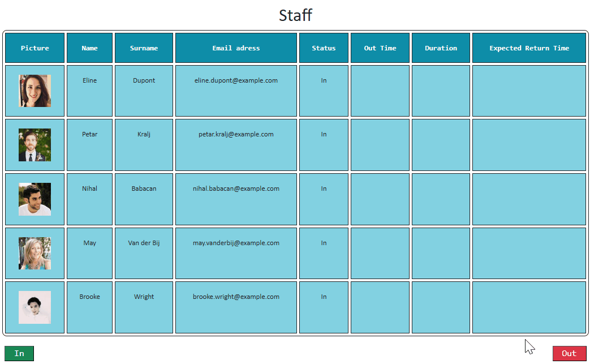
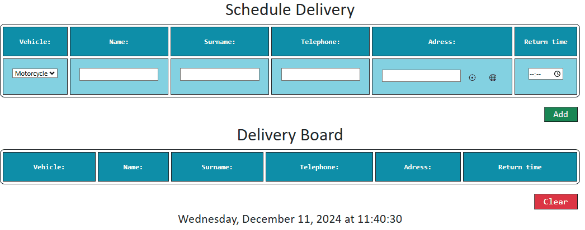
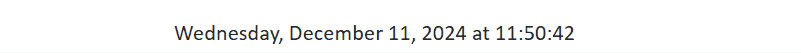

# Web Application Documentation

## Overview

This application is designed for WeDeliverTECH™.

This application serves as a platform for receptionists of WeDeliverTECH™ to manage their reception activities, focusing on staff member out-of-office clocking functionality and notification system as well as tracking deliveries of orders to customers. The application provides an intuitive Reception Management dashboard to help the receptionist manage staff presence and delivery information effectively.

## Structure

### **Frontend**

   - **Components:**

     - **HTML**: Provides the structure of the application.
     - **CSS (Bootstrap & Custom Styling)**: Ensures responsive design and adherence to branding guidelines.
     - **JavaScript (Vanilla JS and Bootstrap)**: Adds interactivity and handles dynamic content.

   - **Features:**
     - Navbar for navigation.
     - Tables for staff and delivery management.
     - Notification UI using Bootstrap toasts.

### **Backend**

  - **Class Modules**: Encapsulate core logic for staff, delivery, and time operations.
    - `Factory`: Design Pattern used to simplify the creation of class instances.
    - `Employee`: Base class for staff and delivery.
    - `Staff` & `Delivery`: Subclasses extending `Employee`.
    - `Time`: Handles all time-based calculations.
    - `Notification`: Single class with methods for different notification types.
  - **Notification System**: Manages real-time alerts for late staff and deliveries.
  - **Factory Design Pattern**: Facilitates object creation for staff, delivery, time, and notifications.

- **Core Features:**
  - Clock-in/clock-out for staff.
  - Delivery scheduling and tracking.
  - Notification creation using polymorphic classes.

3. **Data Handling:**
   - **API's and Libraries:**
     - Uses the [Random User API](https://randomuser.me/) to fetch demo staff data.
     - [Leaflet](https://leafletjs.com/) for address mapping and geolocation.
   - **Utility Modules:**
     - Handle DOM manipulation and reusable functions.

---

### **Modular**

The application is built on a modular structure for the purpose of scalability and maintainability:

- **Web Application Directories:**
  - `api/`: Manages external API calls.
  - `assets`: Application assets such as company logo.
  - `classes/`: Encapsulates logic for employees, notifications, and time operations.
  - `styles/`: Custom CSS styles.
  - `utils/`: Shared utility functions.
- **Main Script:** `wdt_app.js` handles module integration and event handling.

---

### **Functionality**

#### **Staff Management**

- Fetches staff data from the API.
- Displays staff details in a table.
- Allows receptionists to log staff out and back in.
- Generates notifications for late staff.

#### **Delivery Management**

- Accepts delivery driver details via a schedule form.
- Displays delivery details in a dedicated table.
- Alerts the receptionist if a delivery driver is late.
- Deliveries can be cleared from the delivery board.

### **Notifications**

- Utilizes Bootstrap toast notifications.
- Polymorphic implementation for staff and delivery alerts.
- Notifications persist until manually dismissed.

---

## **Dependencies**

The application uses several external libraries to provide different functionalities. Bootstrap and Random User API are part of the core project requirements, while others add extra features to enhance user experience. The key libraries include:

- **Bootstrap**: Provides a responsive CSS framework for consistent styling.
  - By default, we have implemented Boostrap through CDN for linking the CSS and JavaScript.
  - These will be found in the `<head>` of `index.html`:
    ```html
    <link
      href="https://cdn.jsdelivr.net/npm/bootstrap@5.3.0/dist/css/bootstrap.min.css"
      rel="stylesheet"
    />
    <script src="https://cdn.jsdelivr.net/npm/bootstrap@5.3.0/dist/js/bootstrap.bundle.min.js"></script>
    ```
  - However another option is to download the CSS and JavaScript compiled versions from Bootstrap's official website https://getbootstrap.com/
    - Ensure that the `<head>` section of the `index.html` page as `<meta name="viewport" content="width=device-width, initial-scale=1">`
    - Aso make sure the HTML5 doctype `<!DOCTYPE html>` to ensure proper styling.
- **Random User API**: Used to generate demo information for five unique staff members.
  - The API is used to fetch random user data to populate the staff table.
  - To use it, we simply make a GET request to `https://randomuser.me/api/?results=5&seed=wdttm`.
    - the paremeter `results` ensures we get 5 users.
    - the paremeter `seed` ensures we receive unique users each time. This seed can be anything really, for this project we have just provides `wdt` as short for WeDeliverTECH™.
    - The response contains JSON data, which is then processed by the `staffUserGet` function in `wdt_api.js`
- **Leaflet**: Used to implement map features for address input and selection (This is an additional feature).
  - For this project, we are using the Leaflet CDN.
    ```html
    <link rel="stylesheet" href="https://unpkg.com/leaflet@1.9.3/dist/leaflet.css" />
    <script src="https://unpkg.com/leaflet@1.9.3/dist/leaflet.js"></script>
    ```
  - We are using our map inside a `<div>` to display the map, which will be toggled upon click of hte map button. The rest of the javascript code happens in `wdt_map.js`.
- **Leaflet Geosearch**: Provides search capabilities within the Leaflet map to allow users to locate addresses (This is an additional feature).
  - For this project, we are using the Leaflet Geosearch CDN.
    ```html
    <link
      rel="stylesheet"
      href="https://cdn.jsdelivr.net/npm/leaflet-geosearch@3.4.0/dist/geosearch.css"
    />
    <script src="https://cdn.jsdelivr.net/npm/leaflet-geosearch@3.4.0/dist/geosearch.umd.js"></script>
    ```
- **Nominatim API**: Converts latitude and longitue coordinates to actual adresses (This is an additional feature).
  - This API is used i `wdt_api.js` to convert coordinates into readable adresses.
  - The function `fetchAdress` makes an API call and returns a formatted string.
  - To use it, we simply make a GET request to `https://nominatim.openstreetmap.org/reverse?format=json&lat={lat}&lon={lng}`.
  - Our `fetchAdress` function replaces `{lat}` and `{lng}` with the current browsers location.

---

## **Deployment**

- **Hosting Requirements**: Can run on any modern web server.
- **Browser Support**: Compatible with major browsers (Chrome, Firefox, Edge, Safari).
- **Getting Started**:
  - Clone the repository.
  - Open `index.html` in a web browser.
  - You can view a demo of the project here: [wdt_demo](https://yosmelchiang.github.io/wdt_demo/Web%20Application/index.html)

## End-User Instructions

- **Staff Member Management**:
  - To **clock out** one or multiple staff members, simply select the staff members and click the **Out** button. Enter the expected absence duration, and the system will calculate the expected return time as well as visually provide a new status for the staff.
  - To **clock in** one or multiple staff members, simply select the staff members and click the **In** button. This will clear their out-of-office status. If a staff member does not return in time, a notification with their picture, name and overdue duration will be shown.
  

- **Deliveries**:

  - To add a delivery, manually enter the driver information and click the **Add** button. The delivery board will display the driver details and their expected return time.
  - If a driver has not returned by the expected return time, a notification with relevant details for the receptionist to reach out to the driver will be shown.
  - To clear a driver from the delivery board, select one or more rows and click the **Clear** button. A comfirmation popup will be shown to confirm the removal of the driver to prevent accidental clearing.
    
    - To avoid a large sized picture, we are not showing the confirmation popup in the picture above.

- **Map (Additional feature)**:
  - Use the **crosshair** button to apply the current browsers location to the input adress field or the **Map** button to look up and select an adress manually.
    
- **Digital Clock**:
  - The current date and time are displayed at the bottom of the page and updates every second.
    

## Developer Notes

- The main application logic is defined in `wdt_app.js`, which acts as the main entry point for managing components and initializing features. DOM elements and utilities are defined in `utils/`, which hosts utilities for the tables, as well as the user interface interactions and validations.
- The **staffUserGet** function makes the API call to Random User API and processes the response to create staff objects and populate the DOM table.
- Modular JavaScript is used to keep code maintainable, with each component and class serving a specific purpose.
- CSS styles are defined in `wdt_style.css` to maintain consistent styling throughout the application and adhere to the branding guidelines.
- Hover animations are implemented for the navbar and buttons to enhance the user experience.


## Credits

This project was created and maintained by [Yosmel Chiang](https://github.com/yosmelchiang).

Contributions, suggestions, and improvements to the project are welcomed.

## License

This project is licensed under the MIT License.
